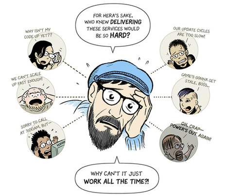
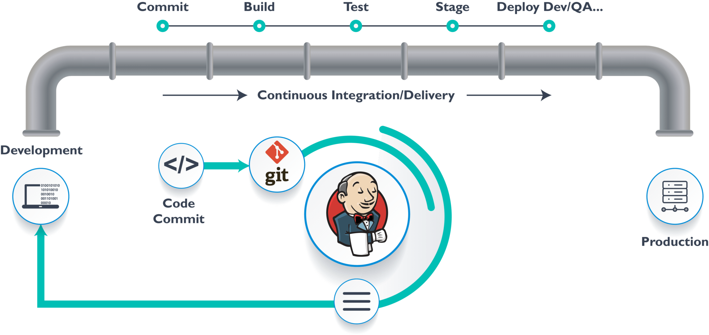

# Why CI/CD?

The use of [<b>GitHub</b>](https://en.wikipedia.org/wiki/GitHub) since its inception has been authentic. Millions of developers have been using it and referring it in case of support and guidance. However, with the enhancement in technology and the new age, things have been rapidly changing, the need for an invention at every turning point has been imperative. 

- ## Without Continous Integration

    Now here's a scenario, Let's assume you are a software developer and a team of 15 members working on a common project which is being used by the public, which also means the code is deployed on the cloud. You have a GitHub repository consisting of the necessary documents and codes of the entire team's work. All of you working on the same project but from different machines. Now assuming "Person A" does some modifications and just because his local system and GitHub are connected, the changes are reflected online once pushed, which is also witnessed by the other 14 team members. Now "Person B" (maybe the one who has authority to push changes to the master branch) has to ensure that whatever "A" has written is working alright. To run the code without any hassles, poor "B" has to download all the packages "A" has used during modifications, then he need to build the code (convert into executable format) check the code against the necessary test cases and if he's satisfied, deploy the modified code on the cloud.

    

    Now now, how many times do you think the team is going to repeat the above-stated process? How boring and tedious of a task is that? Let's dissolve the useless team and talk about facts now.

- ## Jenkins

    Like I mentioned at the very beginning, we all have become hungry for a new invention, a new tool which makes our work easier and lessens the burden. To solve the aforementioned problem, there were developers kind enough to come up with something called <b>Continous Integration</b> and *Jenkins* is one of the tool. Now, what do you reckon is Jenkins? Well then let's get explaining, [<b>Jenkins</b>](https://en.wikipedia.org/wiki/Jenkins_(software)) is a free and open-source automation server. It helps automate the parts of software development related to building, testing, and deploying, facilitating continuous integration and continuous delivery. It is a server-based system that runs in servlet containers such as Apache Tomcat. 

    Okay, that was Google speaking to you though it wasn't half bad. In plain English, Jenkins is something that automates the whole process of building, testing and deploying. So why we need to build the code? Remember the times you downloaded .exe files or binaries, yeah like just yesterday. Did you have to download silly packages during installation? Or think of this, while downloading an app from Play Store, do you download packages? Exactly my point! No! It's pretty simple, just click and it does the work (PS: You need to provide instructions for the first time). Similarly, Jenkins 'kinda' makes the whole process of DevOps simple. Now how does Jenkins do it? It cannot be as simple as downloading an app from the store, what is it called coding for then? So the process is as follows:
    1. You link Jenkins and GitHub repository just like you linked your local machine and GitHub. 
    2. Now you, the developer make all the modifications and create a branch, pushing the code and also testing team will write testcase for that code and push the changes or add a new feature into the repository. 
    3. The admin now has to make the decision whether to let the master allow/accept the branch or not. 
    4. Once the code is moved to master(by default), the build trigger of Jenkins is pulled off. Now it has detected the change and is awake and ready to do its job.

    

    Now is the time to provide instructions to Jenkins, I know I said it was automated, but come on, you don't want it behaving like a lunatic doing everything on its own. At least a few instructions would help.<br> 
    First and foremost, you ask Jenkins to build the code, then to execute and check against all the test cases. Once all the test cases are passed, you notice files with .exe extension. These things are called Binaries (or) Artifacts. The folder containing all the Binaries is called the Build Folder. These Build Folders are well built, they are large in size and are not usually shared as they're sensitive and easily corrupt themselves. Hence we put them away safely in something called [<b>JFrog Artifactory</b>](https://jfrog.com/artifactory/) (yes yes, artifacts factory). Interesting right? It is not over yet, stay tuned, it gets more interesting. Now that every important thing is stored within the Artifactory, you run the code locally and directly deploy it. Or, you can just keep the code handy within Artifactory and deploy it whenever you wish to release that version to the customer. It's all set to go! 

    Any feature you want to add, you just have to use one command ```git push``` and Jenkins gets triggered, builds the application with these new changes and your Build Folder is saved in JFrog Artifactory. Jenkins can also deploy the application or you can create an image and push it to Docker Hub, it is now up and ready to face the world. The whole process is called CI/CD which is short for Continuous Integration, Continuous Delivery, and Deployment. The name indefinitely explains itself. We refer to CD as Continuous Delivery when the code is ready to be deployed but isn't deployed, keeping the Build Folder on hold with all major corrections done, whereas Continuous Deployment means the application is deployed i.e, its in production environment. Once deployed, the consumer will be able to use it.

    Therefore, Jenkins is a free and open-source automation server that helps automate the parts of software development related to building, testing, and deploying, facilitating continuous integration and continuous delivery (CI/CD).

- ## Thank you :D

