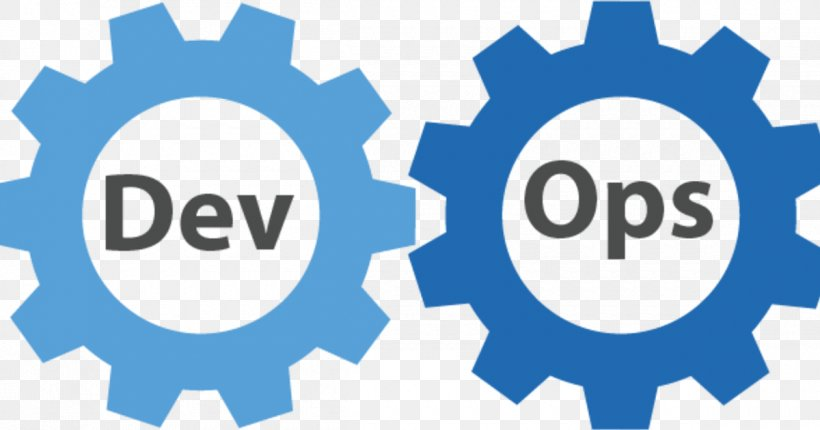
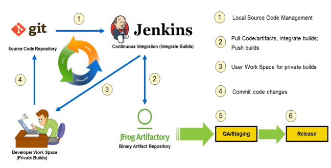
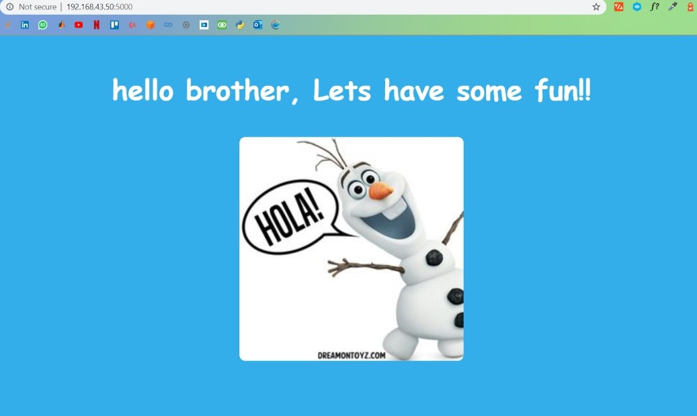
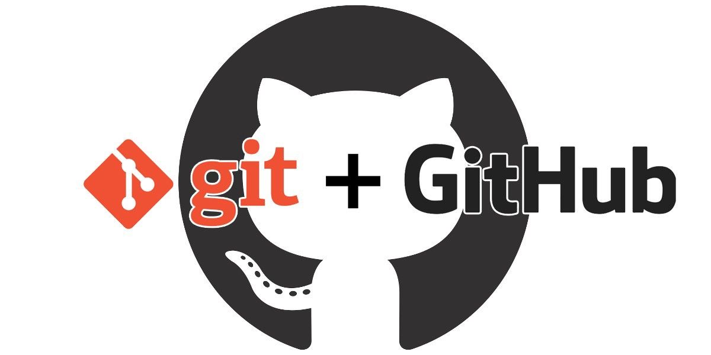
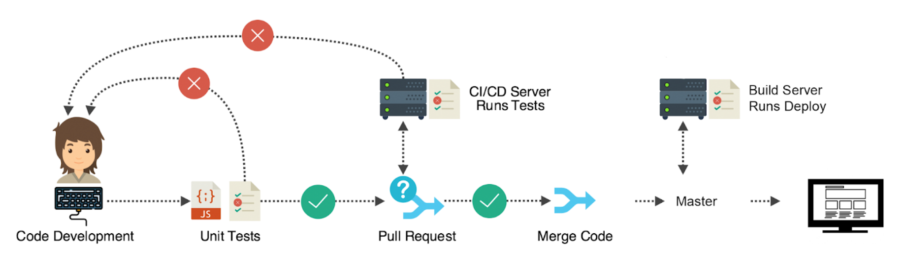
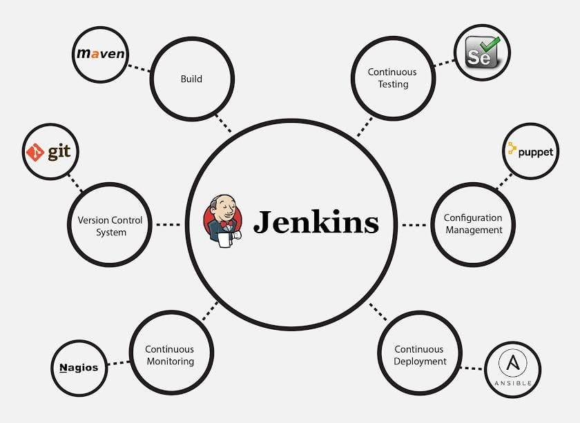
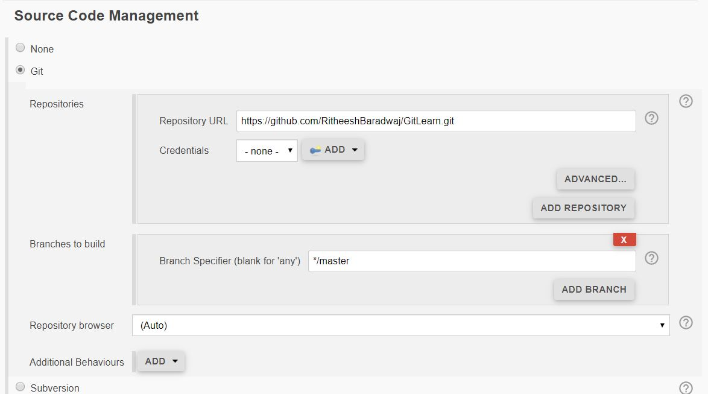
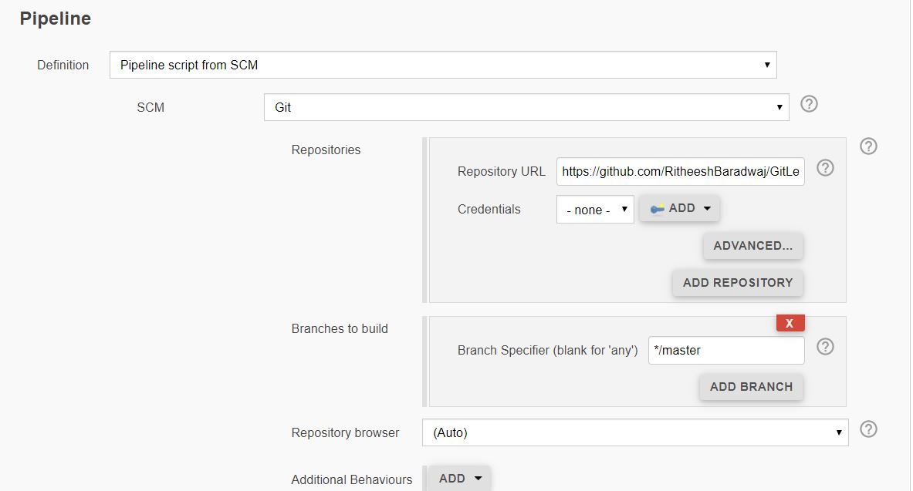
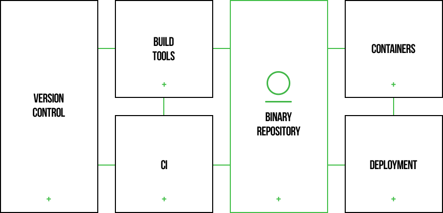

# DevOps Pipeline <a href="https://en.wikipedia.org/wiki/DevOps" ></a>
- ## Background
   Before getting started, [click here](https://github.com/RitheeshBaradwaj/JenkinsPipeline/tree/master/Introduction) if you      want to know what is <b>CI/CD</b> <br>
   CI/CD is a method to frequently deliver apps to customers by introducing automation into the stages of app development. The main        concepts attributed to CI/CD are continuous integration, continuous delivery, and continuous deployment. CI/CD pipelines are designed    for businesses that want to improve applications frequently and require a reliable delivery process. The added effort to standardize    builds, develop tests, and automate deployments is the manufacturing process for deploying code changes.
   <br>
   
- ## Project Aims
    In this project I pushed my project code to GitHub] which is linked with Jenkins, which is responsible to build, test and deploy it into production facilitating continuous integration and continuous delivery. In turn, the binaries generated from the build process will be stored in JFrog Artifactory. I developed a basic python application using Flask. I'll walk you through the process and try to provide useful information to write code and serve it to your customers or friends. So Let's get started!
- ## Python Application
    <a href="https://www.python.org/" ></a>
    Let's start with a simple application. You can use this project or you can develop your own [Flask](https://flask.palletsprojects.com/en/1.1.x/quickstart/) Application.

    

    Using the below commands you can run this application on your localhost.

    ```
    pip install -r requirements.txt
    ```
    
    ```
    python app.py
    ```
    Our application will try to display a random message on our webpage when the user gave a string as input. Visit http://localhost:5000/username as shown below in the url.

    

    We write code for our application and also the testcases that our application should pass. I wrote two testcases where the server status will be tested. You can explore [Testing in Python](https://realpython.com/python-testing/) to write your own testcases.
    ```
    python test.py
    ```
    Now we have the required files to run our application. But this project is local to our machine. So we are going to push our project or repository on GitHub.

- ## Source Code Reposirtory
    <a href="https://github.com/" ></a>
    [GitHub](https://en.wikipedia.org/wiki/GitHub), is a United States-based global company that provides hosting for software development version control using [Git.](https://git-scm.com/) In order to learn more about Git, Please visit my repository [GitLearn.](https://ritheeshbaradwaj.github.io/GitLearn/) I used GitHub to upload my repository, you can use other tools as well GitLab, BitBucket, SourceFrog...

    

    The main purpose of this step is to collaborate with our teammates and it allows your work to get out in front of the public as well. So whenever you want to change or add or delete any features you can simply change your code in your local machine and then push the changes to GitHub repository.
    Create a repository on GitHub and use the following commands to push your code remotely.

     ```
    git init
    git add *
    git commit -m "commit message"
    git remote add origin <url_of_your_repo>
    git push origin master
    ```
    
    

    Let's say you want to add some features to your application which is already in the production stage. You will simply make the changes, write testcases for this new feature and push this feature to GitHub. Later CI/CD server which is linked with our repository will get triggered whenever a new commit is made by the user. It will build, test and deploy our application where the customer will able to use our new application.

- ## Contionus Integration - Jenkins
    <a href="https://en.wikipedia.org/wiki/Jenkins_(software)" ></a>
    We have our project on GitHub, but who is going to build or test and deploy it. We can do manually, but its not an ideal case to repeat the process for every new feature. So there is a need for Continous Integration. Jenkins is an open-source automation tool written in Java with plugins built for Continuous Integration purposes. Jenkins is used to build and test your software projects continuously making it easier for developers to integrate changes to the project, and making it easier for users to obtain a fresh build.

    

    - You can install [Jenkins](https://jenkins.io/download/) on your host and run it as a service.
    - Create a Job on Jenkins using this [tutorial.](https://www.youtube.com/watch?v=RR0LabeUQ88) Also try to link Jenkins with your GitHub repository. While creating the Job add your GitHub repository url as shown below in the Source Management section.

        
    - You can also configure Jenkins to build everytime you push changes to your repository in the Build Triggers section.
    - To tell Jenkins server to perform certain tasks i.e, to automate build, test and deploy (we can include any other stages) we often write instructions to be followed by Jenkins server in Jenkinsfile. To use this you need to install Pipeline plugin on Jenkins
    - [Jenkins Pipeline](https://jenkins.io/doc/pipeline/tour/getting-started/) is a suite of plugins which supports implementing and integrating continuous delivery pipelines into Jenkins. A continuous delivery pipeline is an automated expression of your process for getting software from version control right through to your users and customers. Jenkins Pipeline provides an extensible set of tools for modeling simple-to-complex delivery pipelines "as code". The definition of a Jenkins Pipeline is typically written into a text file (called a Jenkinsfile) which in turn is checked into a project’s source control repository.

    In the current project I provided instructions to Jenkins, to build my python application, test it and upload the artifacts or binaries or by products to JFrog Artifactory. In order to use Jenkinsfile you need to select Pipeline option while creating while creating a Job.
    
    

   In this pipeline , I'm not deploying application on sever, but when you build the Job you can use the applicayion in your localhost, port:5000. Check this [tutorial](https://www.youtube.com/watch?v=_o42ZCkCJb4) for further details to use Jenkinsfile in pipeline. The Artifactory stage that used in the Jenkinsfile will be coverd below.

- ## JFrog Artifactory
    <a href="https://jfrog.com/" ></a>
    JFrog Artifactory is a tool designed to store the binary output of the build process for use in distribution and deployment. Artifactory provides support for a number of package formats such as Maven, Debian, NPM, Helm, Ruby, Python, and Docker.
    - An artifact is one of many kinds of tangible by-products produced during the development of software. Some artifacts (e.g., use cases, class diagrams, and other Unified Modeling Language (UML) models, requirements and design documents) help describe the function, architecture, and design of software.
    - If we have resources like GitHub, why we require other tools? It is because we cannot store files of all formats on GitHub. To store executale files even if the size is large, Artifactory will supports them. It resolve dependencies when creating the build, and also as a target to deploy build output to the corresponding local repository. One of the main benefits of running builds through Artifactory is fully reproducible builds.
    - We can store binaries of our application with different version and we can deploy or use them at any point.

        

    - You can use [jfrog](https://jfrog.com/open-source/) open source. Use this [tutorial](https://www.youtube.com/watch?v=Lg4a6Sc_Xco) to install artifactory as a service on windows.
    - For Ubuntu use [this.](https://websiteforstudents.com/how-to-install-jfrog-artifactory-on-ubuntu-18-04-16-04/)
    - Now in our machine artifactory will run as a service.
    You can use the console to create repostories and explore. Also you can install JFrog - CLI to interact through terminal.
    - Install [Chocolatey](https://chocolatey.org/docs/installation) and run the below command.
    ```
    choco install jfrog-cli
    ```
    - Before start using artifactory you need to configure the Artifactory URL, user and password by passing them in as command options. Here rt-server is the name of our server id, we give it any name and url is the link where your artifactory server is running, by defaut it will be http://localhost:8081/artifactory
    ```
    jfrog rt c rt-server --url=http://domain/artifactory --user=admin --password=password
    ```
    - To upload a file to a repository. Here gernic-local is a miscellaneous repository name, you can check it on console.
    ```
    jfrog rt u "path to your file" generic-local
    ```
    Visit [JFrog CLI](https://www.jfrog.com/confluence/display/CLI/CLI+for+JFrog+Artifactory) for more commands.

    You can deploy the application on any cloud platform or you can push the build image to docker hub.
- ## References
    - [Python Flask Application](https://flask.palletsprojects.com/en/1.1.x/tutorial/)
    - [Python Testing](https://docs.python.org/3/library/unittest.html)
    - [Git & GitHub](https://www.datacamp.com/community/tutorials/git-push-pull)
    - [Jenkins](https://www.vogella.com/tutorials/Jenkins/article.html)
    - [JFrog Artifactory](https://www.youtube.com/watch?v=WrKEozY9efQ)
- ## Thank you :D
    I have used many online resources while creating the application and I would like to thank them. As I'm also in a learning stage, I would like to know your feedback and suggestions as well. So please contact me at: ritheeshbaradwaj@gmail.com. 
